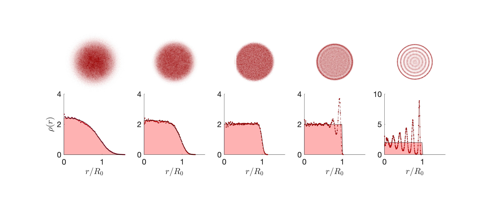

# ChiralEdgeWaves

Solves for lowest energy states of quantum vortex matter in free space under damped evolution from thermal friction.

Analogues of the FQHE emerge at low energies where the Rankine vortex deviates from the classical prediction

